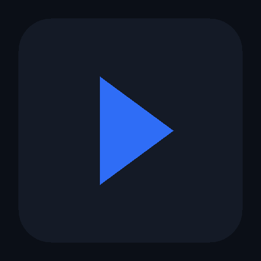

# IPTV for Samsung Tizen TV

A lightweight IPTV player for **Samsung Smart TVs (Tizen)** that streams live
channels from an **M3U / M3U8 playlist**. Built as a vanilla JavaScript Tizen
web app — no frameworks, no bundler — so it stays fast and easy to package.



## Features

- **M3U / M3U8 playlist support** — parses extended `#EXTINF` attributes
  (`tvg-name`, `tvg-logo`, `group-title`, `tvg-chno`, `#EXTGRP`).
- **Channel browser** — categories sidebar + channel list with logos
  (initials fallback), channel numbers and a live clock.
- **Robust HLS playback** — uses Samsung's **AVPlay** API on real hardware,
  with an automatic **HTML5 `<video>`** fallback for development and
  native-HLS TVs.
- **Full TV-remote control** — D-pad navigation, OK to play, number-key
  **zapping**, channel up/down, play/pause/stop, and the four colour keys.
- **Favorites** — mark channels with the yellow key; a Favorites category is
  added automatically (persisted in `localStorage`).
- **YouTube live channels** — a `📺 YouTube` category checks listed channels for
  live status via the **YouTube Data API v3**; live channels play in an embedded
  player, offline ones show their latest video and when it last streamed. Edit
  the list in `config/youtube_channels.json` and enter a free API key in
  **Settings** (see *YouTube channels* below).
- **Search** — filter channels by name/group via an on-screen keyboard.
- **Settings** — change the playlist URL with the on-screen keyboard, switch
  to the bundled sample, or clear favorites. Settings persist across launches.
- **1080p UI** designed for the 10-foot viewing experience.

## Remote control

| Key | Channel browser | Player |
| --- | --- | --- |
| ◀ ▲ ▼ ▶ | Move between categories / channels | ▲▼ change channel; ◀▶ show info |
| **OK** | Enter category / play channel | Play / pause |
| **Back** | Exit app | Return to channel list |
| **0–9** | Jump to channel number | Zap to channel number |
| **CH ▲ / CH ▼** | Move in channel list | Previous / next channel |
| 🔴 Red | Reload playlist | — |
| 🟢 Green | Open Settings | — |
| 🟡 Yellow | Toggle favorite | — |
| 🔵 Blue | Search | — |
| ▶/⏸ ⏹ | — | Play-pause / stop |

## Project layout

```
config.xml                 Tizen application manifest (privileges, profile)
index.html                 App shell / screens
icon.png                   App icon
css/style.css              1080p TV-optimized styling
js/
  keys.js                  TV remote key codes + registration
  storage.js               localStorage settings (URL, favorites, last channel)
  playlist.js              M3U / M3U8 parser + loader
  focus.js                 D-pad list navigation with auto-scroll
  keyboard.js              On-screen keyboard for URL / search entry
  player.js                AVPlay + HTML5 video playback abstraction
  youtube.js               YouTube live detection + metadata extraction
  ui.js                    DOM rendering (groups, channels, OSD, toasts)
  app.js                   Controller / state machine + key router
config/playlist.example.m3u  Bundled sample playlist (public test streams)
config/youtube_channels.json YouTube channels checked for live status
scripts/
  dev-server.js            Static server for browser testing
  build-wgt.sh             Package an (unsigned) .wgt archive
```

## Develop in a browser

The app is plain HTML/CSS/JS, so you can run and exercise the whole UI in a
desktop browser (keyboard arrows + Enter map to the D-pad; `Esc`/`Backspace`
act as Back).

```bash
npm run dev          # serves on http://localhost:8080
# or: node scripts/dev-server.js 8080
```

> Note: raw HLS `.m3u8` streams only play in browsers with native HLS support
> (e.g. Safari). On Samsung TV hardware, AVPlay handles HLS natively.

## Configure your playlist

1. Launch the app and press the **green** (Settings) key.
2. Select **Playlist source** and enter your M3U / M3U8 URL with the on-screen
   keyboard, or choose **Use bundled sample playlist**.
3. Press **Back** to save and reload.

The URL is remembered between launches.

## YouTube channels

The `📺 YouTube` category checks each listed channel for a live broadcast and,
when offline, shows its latest video. Detection uses the **YouTube Data API v3**
(the only reliable way from a TV browser — scraping youtube.com is blocked by
CORS and consent redirects).

1. **Get a free API key:** in the
   [Google Cloud Console](https://console.cloud.google.com/), create a project,
   enable **"YouTube Data API v3"**, then create an **API key** under
   *APIs & Services → Credentials*. Enter it via **green** (Settings) →
   **YouTube Data API key**.
2. **Host the player page** (required for playback on the TV). The TV app runs
   from a `file://` origin, where a YouTube embed fails with *"Error 153"*
   (no referrer). To fix this, the bundled [`player.html`](player.html) must be
   served over **https** so the embed gets a valid referrer:
   - Enable **GitHub Pages** for this repo (Settings → Pages → deploy from the
     default branch), which publishes `player.html` at
     `https://<user>.github.io/<repo>/player.html`.
   - In the app: **green** (Settings) → **YouTube player page URL**, and enter
     that URL. The app opens it as `…/player.html?v=<videoId>`.
   - (Any https host works — Netlify, your own domain, etc. — just point the
     setting at wherever `player.html` lives.)
3. **Edit the channel list** in `config/youtube_channels.json` — each entry is
   `{ "handle", "name", "channelId" }`. The `channelId` (a `UC…` string) is what
   the API uses; find it on the channel's page or via the API.

Notes:
- Live and offline channels both play through the embedded YouTube player.
- The API has a daily quota (10,000 units; each live check is ~100 units), so
  the app checks on opening the category and caches results for a few minutes
  rather than polling continuously.
- Remote control inside the YouTube embed is limited (it's a cross-origin
  frame); use **Back** to return to the channel list.

## Build & install on a TV

A Tizen `.wgt` is a ZIP of the project with `config.xml` at the root. For real
installation it must be **signed** with author + distributor certificates.

### Quick unsigned archive (for inspection / CLI input)

```bash
npm run build        # writes build/IPTV.wgt
```

### Signed package with Tizen Studio CLI

Install [Tizen Studio](https://developer.tizen.org/development/tizen-studio)
and create a signing profile, then:

```bash
# 1. Create an author + distributor certificate profile (once):
tizen certificate -a IPTV -p 1234 -f iptv-author -- ~/tizen-certs
tizen security-profiles add -n IPTVProfile -a ~/tizen-certs/iptv-author.p12 -p 1234

# 2. Build and package:
tizen build-web -- .
tizen package -t wgt -s IPTVProfile -- .buildResult

# 3. Install on a TV in Developer Mode (replace with your TV's IP):
sdb connect 192.168.1.50
tizen install -n IPTV.wgt -t <device-id>
```

### Enable Developer Mode on the TV

On the Samsung TV: **Apps → press `1 2 3 4 5`** to open the Developer Mode
dialog, turn it **On**, and enter your development PC's IP address, then
restart the TV. Connect with `sdb connect <tv-ip>`.

## How playback works

`js/player.js` exposes one API used by the controller:

```js
Player.init();                       // picks AVPlay or HTML5 automatically
Player.play(channel, handlers);      // handlers: onBuffering/onPlaying/onEnded/onError
Player.togglePause();                // -> 'playing' | 'paused'
Player.stop();
```

- **AVPlay** (`webapis.avplay`) renders into the `<object type="application/avplayer">`
  element, set to a full 1920×1080 display rect with letterboxing. This is the
  recommended path on Samsung TVs and supports HLS, DASH and progressive
  streams with hardware decoding.
- **HTML5 `<video>`** is used wherever AVPlay is unavailable.

## License

MIT
